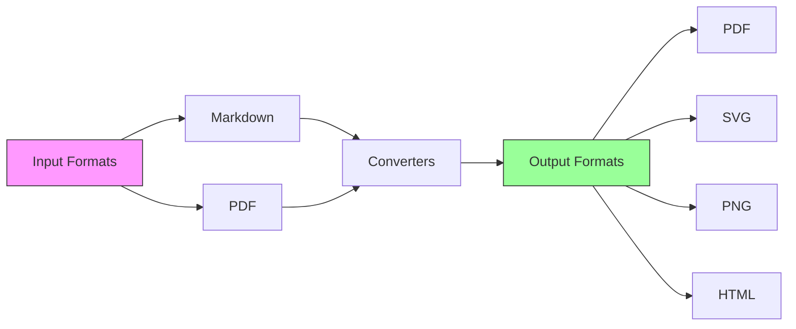
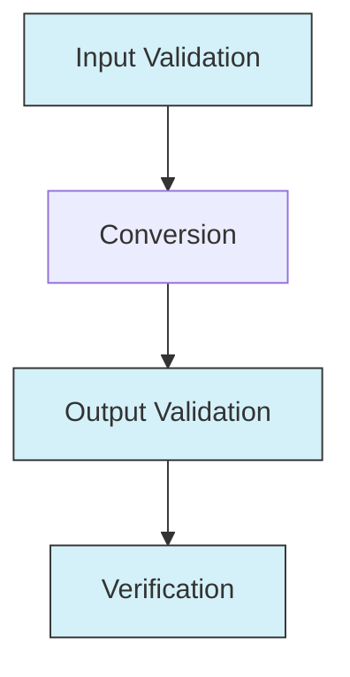
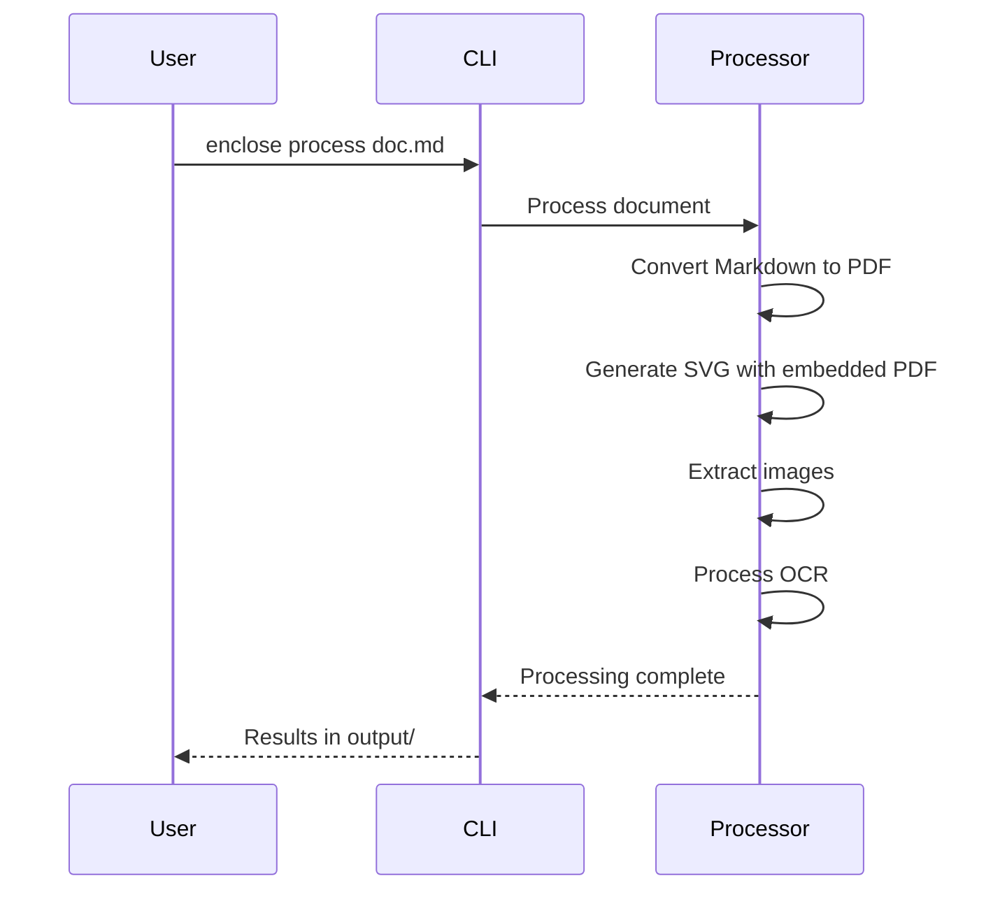
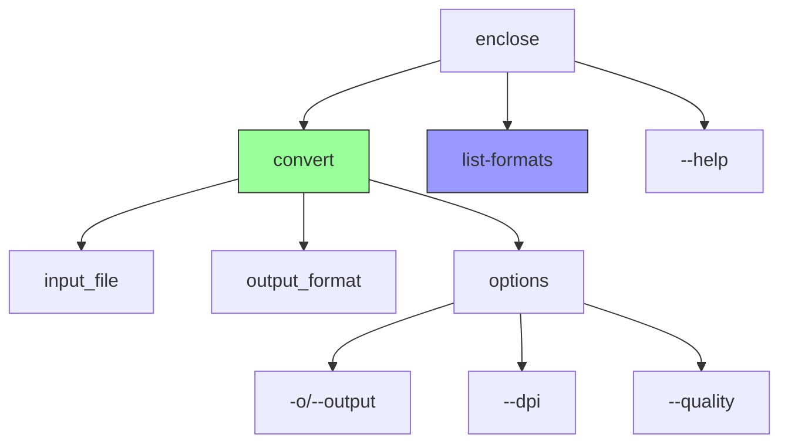
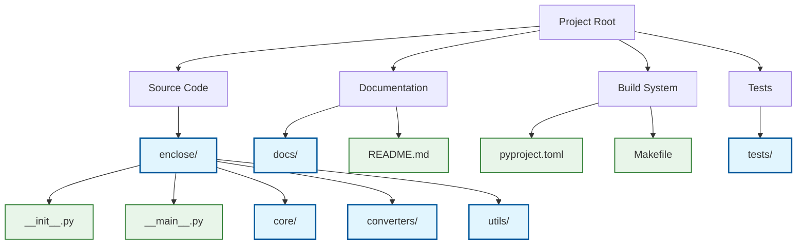
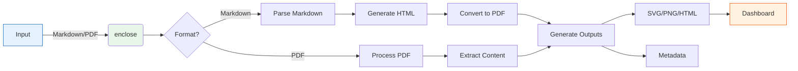

# Enclose

A comprehensive document processing pipeline for Markdown to PDF/SVG/PNG conversion with OCR capabilities.


## 🚀 Features



- **Multi-format conversion**: Convert between Markdown, PDF, SVG, and PNG
- **SVG embedding**: Embed PDFs as base64 data URIs in SVG containers
- **Image extraction**: Extract high-quality images from PDFs
- **OCR processing**: Extract text with confidence scoring
- **Metadata tracking**: Preserve and enhance metadata throughout processing
- **Interactive dashboard**: View and search processed documents

## ✅ File Format Validation

Enclose includes comprehensive file format validation to ensure the integrity and correctness of all converted files:



### Validation Checks

#### PDF Files
- ✅ Valid PDF signature (`%PDF` header)
- ✅ Correct MIME type (`application/pdf`)
- ✅ File integrity verification

#### SVG Files
- ✅ Valid XML structure
- ✅ Correct MIME type (`image/svg+xml`)
- ✅ Basic SVG tag validation

#### PNG Files
- ✅ Valid PNG signature (magic bytes)
- ✅ Correct MIME type (`image/png`)
- ✅ Image data integrity check
- ✅ PIL verification of image data

### Example Validation Output

```bash
# When running tests, you'll see validation output like:
PASSED tests/test_file_formats.py::test_pdf_conversion
PASSED tests/test_file_formats.py::test_svg_conversion
PASSED tests/test_file_formats.py::test_png_conversion
```

## 📚 Documentation

For complete documentation, please visit our [documentation site](docs/index.md).

## 🛠️ Quick Start

### Prerequisites

- Python 3.8+
- [Poetry](https://python-poetry.org/) (for development)

### Installation

1. Clone the repository:
   ```bash
   git clone https://github.com/yourusername/enclose.git
   cd enclose
   ```

2. Install dependencies:
   ```bash
   poetry install
   ```

3. Install the package in development mode:
   ```bash
   poetry install
   ```

### Basic Usage

1. **List supported formats**:
   ```bash
   enclose --list
   ```

2. **Convert a markdown file to another format**:
   ```bash
   # Basic conversion (outputs to current directory with default name)
   enclose example.md pdf
   
   # Specify output filename
   enclose example.md pdf -o output.pdf
   
   # Convert to SVG
   enclose example.md svg -o output.svg
   
   # Convert to PNG
   enclose example.md png -o output.png
   
   # Convert to HTML
   enclose example.md html -o output.html
   ```

### Example

1. First, create a test markdown file or use the provided `example.md`

2. Convert it to different formats:
   ```bash
   # Convert to PDF
   enclose example.md pdf -o example.pdf
   
   # Convert to SVG
   enclose example.md svg -o example.svg
   ```

### Important Notes

- The `-o` or `--output` flag requires a full file path with extension (e.g., `output.pdf`, `./output.svg`)
- If no output is specified, the output will be saved in the current directory with a default name based on the input file
- The output directory must exist before running the command

3. The output will be saved to `output/example.pdf`

### Command Line Options

```
usage: enclose [-h] [--version] [--list] [-o OUTPUT] [input] [{pdf,png,svg,html}]

A document processing tool for format conversion.

positional arguments:
  input                 Input file path (markdown, pdf, etc.)
  {pdf,png,svg,html}    Output format

options:
  -h, --help            show this help message and exit
  --version             show program's version number and exit
  --list                List supported formats and conversions
  -o OUTPUT, --output OUTPUT
                        Output directory (default: current directory)
```

### Development

To run tests:
```bash
make test
```

To run linting:
```bash
make lint
```

To run type checking:
```bash
make typecheck
```

### Prerequisites

- Python 3.8.1+
- [Poetry](https://python-poetry.org/) for dependency management
- System dependencies (see [Installation Guide](docs/getting-started/installation.md))

### Installation

```bash
# Clone the repository
git clone https://github.com/veridock/enclose.git
cd enclose

# Install the package
make install
```

### Basic Usage

```bash
# Process a document
enclose process example.md -o output/

# View the results
open output/dashboard.html  # macOS
# or
xdg-open output/dashboard.html  # Linux
```

## 📖 Documentation Structure

- [Getting Started](docs/getting-started/installation.md) - Installation and setup
- [User Guide](docs/usage/cli.md) - Command reference and usage examples
- [Architecture](docs/architecture/overview.md) - System design and components
- [Development](development/setup.md) - Contributing and development setup

## 🌟 Features in Detail

### Document Conversion
- Markdown to PDF with custom styling
- PDF to SVG with embedded fonts
- High-quality image extraction

### Advanced Processing
- OCR text extraction with confidence scoring
- Metadata extraction and management
- Batch processing support

### Command Line Interface
- Intuitive command structure
- Configurable output formats
- Progress tracking

## 📊 Example Workflow



## 📦 Project Structure

```
enclose/
├── docs/                   # Documentation
├── processor/              # Main package
│   ├── __init__.py
│   ├── __main__.py         # CLI entry point
│   ├── core/               # Core processing logic
│   ├── converters/         # Format converters
│   └── utils/              # Utility functions
├── scripts/                # Helper scripts
├── tests/                  # Test suite
└── pyproject.toml          # Project configuration
```

## 🤝 Contributing

Contributions are welcome! Please see our [Contributing Guide](docs/development/contributing.md) for details.

## 📄 License

This project is licensed under the MIT License - see the [LICENSE](LICENSE) file for details.

## 🧪 Testing

To run the test suite:

```bash
make test
make lint
```

## 🔄 Development Workflow

1. **Set up development environment**
   ```bash
   make install
   ```

2. **Run tests**
   ```bash
   make test
   ```

3. **Format and check code**
   ```bash
   make format
   make lint
   ```

4. **Run the development server**
   ```bash
   make dev
   ```
   - Dashboard opens automatically in browser
   - Access: `output/dashboard.html`

## 🛠️ CLI Commands

### Basic Usage

```bash
# Convert a document
enclose convert input.md pdf -o output/

# List available formats
enclose list-formats
# Show help
enclose --help
```

### Command Structure



### Common Examples

```bash
# Convert Markdown to PDF
enclose convert document.md pdf -o output/

# Convert PDF to high-quality PNG
enclose convert document.pdf png --dpi 300 -o images/


# List all supported formats
enclose list-formats
```

### Advanced Options

```bash
# Set output DPI for images
enclose convert input.pdf png --dpi 150

# Set image quality (1-100)
enclose convert input.pdf jpg --quality 90

# Process multiple files
for f in *.md; do enclose convert "$f" pdf -o output/; done
```

## 📁 Project Structure



### Key Directories

- `enclose/` - Main Python package
  - `core/` - Core processing logic and document handling
  - `converters/` - File format conversion modules
  - `utils/` - Utility functions and helpers
  - `__main__.py` - CLI entry point

- `docs/` - Comprehensive documentation
  - `getting-started/` - Installation and setup guides
  - `architecture/` - System design and components
  - `usage/` - User guides and examples

- `tests/` - Test suite
  - Unit tests
  - Integration tests
  - Test fixtures

### Key Files

- `pyproject.toml` - Project configuration and dependencies
- `Makefile` - Common development tasks
- `scripts/enclose` - Global CLI wrapper script
- `.github/workflows/` - CI/CD pipelines

## 🔄 Workflow



### Processing Steps

1. **Input Handling**
   - Accepts Markdown or PDF files
   - Validates input format and content
   
2. **Conversion**
   - Markdown → HTML → PDF
   - PDF → Images/Text
   
3. **Output Generation**
   - Generate SVG/PNG/HTML outputs
   - Extract and process metadata
   
4. **Visualization**
   - Create interactive dashboard
   - Enable search and filtering

## 🔄 Pipeline Workflow

```
Step 1: CREATE
├── Generate example markdown file (invoice)
└── Output: invoice_example.md

Step 2: MARKDOWN → PDF
├── Convert markdown to styled HTML
├── Generate PDF with CSS styling
└── Output: invoice_example.pdf

Step 3: PDF → SVG
├── Embed PDF as base64 data URI
├── Add SVG metadata (RDF/Dublin Core)
└── Output: invoice_example.svg + metadata.json

Step 4: PDF → PNG
├── Extract PDF pages as PNG images
├── Convert PNG to base64 encoding
└── Output: page_*.png + updated metadata

Step 5: OCR PROCESSING
├── Extract text from PNG images
├── Calculate confidence scores
└── Output: updated metadata with OCR data

Step 6: FILESYSTEM SEARCH
├── Scan for all SVG files
├── Parse SVG metadata
└── Output: svg_search_results.json

Step 7: DASHBOARD CREATION
├── Generate HTML table with thumbnails
├── Embed SVG previews
└── Output: dashboard.html (opens in browser)
```

## 📊 Output Files

### Metadata Structure
```json
{
  "file": "path/to/file.svg",
  "type": "svg_with_pdf",
  "created": "2025-06-25T10:30:00",
  "pdf_embedded": true,
  "total_pages": 1,
  "pages": [
    {
      "page": 1,
      "file": "page_1.png",
      "base64": "iVBORw0KGgoAAAANSU...",
      "ocr_text": "Invoice #INV-2025-001...",
      "ocr_confidence": 95.7,
      "word_count": 45
    }
  ]
}
```

### Dashboard Features
- **SVG Thumbnails**: Direct embedding of SVG files
- **File Information**: Path, size, modification date
- **PDF Detection**: Indicates embedded PDF data
- **Metadata Status**: Shows RDF metadata presence
- **Interactive Links**: Click to open files

## 🛠️ Makefile Targets

| Target | Description |
|--------|-------------|
| `install` | Install dependencies in virtual environment |
| `create` | Create example markdown file |
| `process` | Run conversion pipeline (steps 2-5) |
| `search` | Search filesystem for SVG files |
| `enclose` | Create HTML dashboard |
| `clean` | Remove generated files |
| `clean-all` | Remove everything including venv |
| `help` | Show available commands |

## 🔧 Configuration

### OCR Language Support
```bash
# Install additional languages
sudo apt-get install tesseract-ocr-pol  # Polish
sudo apt-get install tesseract-ocr-deu  # German

# Configure in processor.py
pytesseract.image_to_string(image, lang='pol+eng')
```

### PDF Styling
Modify CSS in `markdown_to_pdf()` method:
```python
styled_html = f"""
<style>
    body {{ font-family: 'Your Font', sans-serif; }}
    /* Add custom styles */
</style>
"""
```

## 🐛 Troubleshooting

### Common Issues

**OCR Not Working:**
```bash
# Check tesseract installation
tesseract --version

# Install language packs
sudo apt-get install tesseract-ocr-eng
```

**PDF Conversion Fails:**
```bash
# Check weasyprint dependencies
pip install --upgrade weasyprint
```

**SVG Rendering Issues:**
```bash
# Install cairo development libraries
sudo apt-get install libcairo2-dev
```

### Debug Mode
```bash
# Enable verbose output
python processor.py --step process --verbose
```

## 📝 License

This project is open source. See LICENSE file for details.

## 🤝 Contributing

1. Fork the repository
2. Create feature branch (`git checkout -b feature/amazing-feature`)
3. Commit changes (`git commit -m 'Add amazing feature'`)
4. Push to branch (`git push origin feature/amazing-feature`)
5. Open Pull Request

## 📞 Support

- **Issues**: GitHub Issues
- **Documentation**: This README
- **Examples**: Check `output/` directory after running pipeline

---

## 🎉 Quick Demo

```bash
# Complete setup and demo
make install
make all

# View results
open output/dashboard.html  # macOS
xdg-open output/dashboard.html  # Linux
```

The dashboard will show your processed documents with interactive thumbnails and metadata!