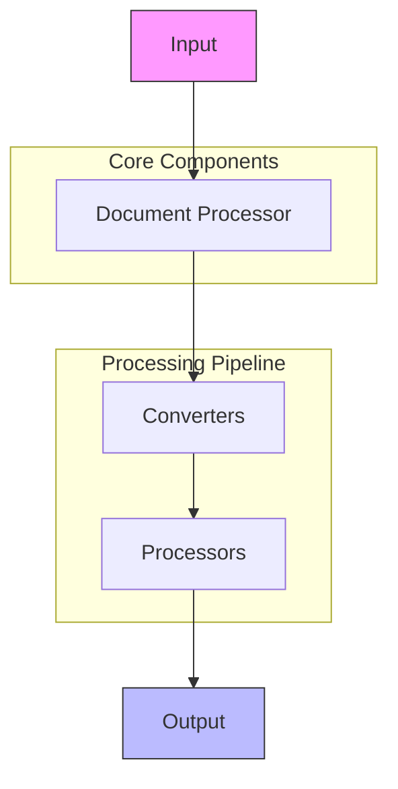
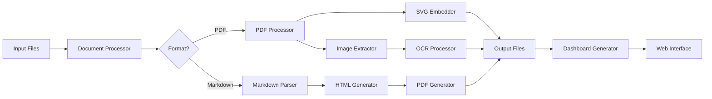
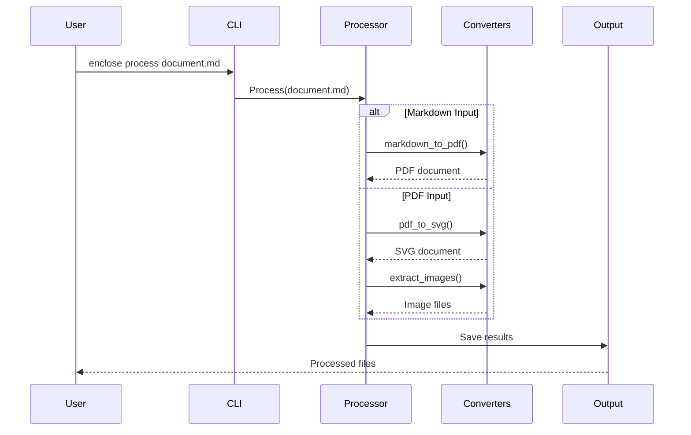
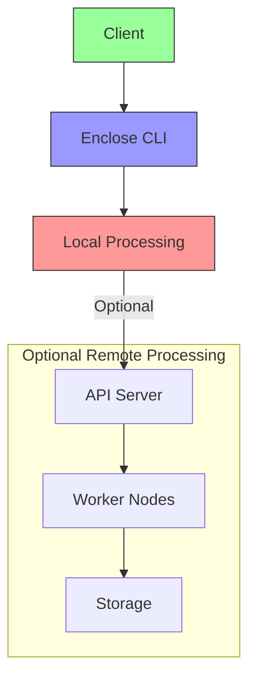

# System Architecture Overview

Enclose is designed as a modular, extensible document processing pipeline. This document provides a high-level overview of the system architecture.

## High-Level Architecture

## Core Components

### 1. Document Processor

The central coordinator that manages the document processing pipeline:

- **Input/Output Handling**: Manages file operations and directory structures
- **Pipeline Management**: Coordinates the flow of documents through the system
- **Metadata Handling**: Maintains document metadata throughout processing
- **Error Handling**: Manages errors and recovery

### 2. Converters

Specialized modules for converting between different document formats:

- **Markdown to PDF**: Converts markdown to styled PDF documents
- **PDF to SVG**: Embeds PDFs in SVG containers
- **PDF to PNG**: Renders PDF pages as PNG images

### 3. Processors

Additional processing modules:

- **OCR Processing**: Extracts text from images
- **Metadata Extraction**: Extracts and processes document metadata
- **Content Analysis**: Analyzes document content

## Data Flow

## System Design Principles

1. **Modularity**: Each component has a single responsibility
2. **Extensibility**: Easy to add new formats and processors
3. **Configurability**: Flexible configuration for different use cases
4. **Error Resilience**: Graceful handling of errors and edge cases
5. **Performance**: Efficient processing of large documents

## Component Interaction

## Error Handling

The system implements a robust error handling strategy:

1. **Input Validation**: Validate all inputs before processing
2. **Graceful Degradation**: Continue processing when possible
3. **Error Reporting**: Provide clear error messages
4. **Recovery**: Allow resuming failed operations

## Performance Considerations

1. **Memory Management**: Process large documents in chunks
2. **Parallel Processing**: Utilize multiple cores when available
3. **Caching**: Cache intermediate results when possible
4. **Resource Cleanup**: Properly release resources after use

## Security Considerations

1. **Input Sanitization**: Prevent injection attacks
2. **File Permissions**: Respect system permissions
3. **Secure Temporary Files**: Safely handle temporary files
4. **Dependency Management**: Keep dependencies updated

## Dependencies

### Core Dependencies

- **Python 3.8+**: Core language runtime
- **WeasyPrint**: HTML to PDF conversion
- **pdf2image**: PDF to image conversion
- **Pillow**: Image processing
- **Tesseract OCR**: Text recognition

### Development Dependencies

- **pytest**: Testing framework
- **black**: Code formatting
- **mypy**: Static type checking
- **flake8**: Code linting

## Deployment Architecture

## Scaling Considerations

1. **Vertical Scaling**: Increase resources for single-machine deployment
2. **Horizontal Scaling**: Distribute processing across multiple machines
3. **Batch Processing**: Process documents in batches for efficiency
4. **Queue Management**: Use message queues for large workloads

## Monitoring and Logging

- **Structured Logging**: JSON-formatted logs
- **Metrics Collection**: Performance metrics
- **Alerting**: Notifications for critical issues
- **Audit Trails**: Track document processing history

## Future Enhancements

1. **Plugin System**: Support for custom processors
2. **Web Interface**: Browser-based UI
3. **Cloud Integration**: Native cloud storage support
4. **Advanced Analytics**: Document insights and analytics
