# Document Processing Pipeline

This document details the step-by-step flow of documents through the Enclose processing system.

## Overview

The processing pipeline consists of several stages, each responsible for a specific transformation or analysis of the document. The pipeline is designed to be modular, allowing for easy extension and customization.

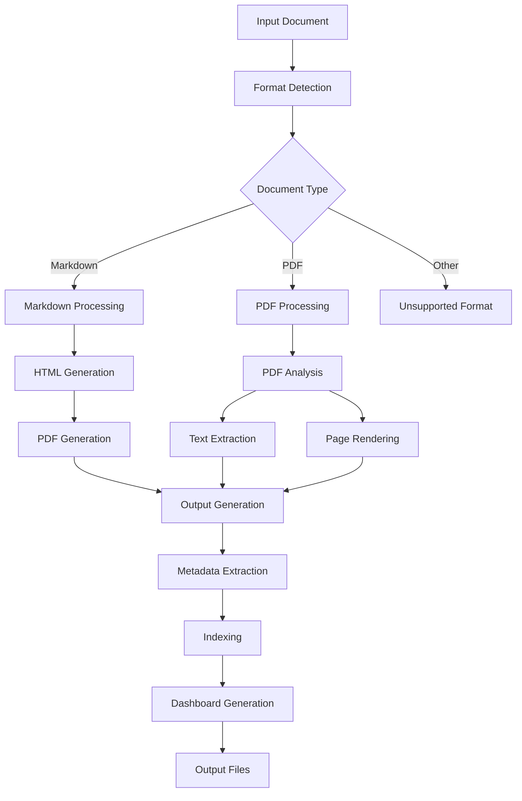

## Detailed Pipeline Stages

### 1. Input Stage

**Purpose**: Accept and validate input documents

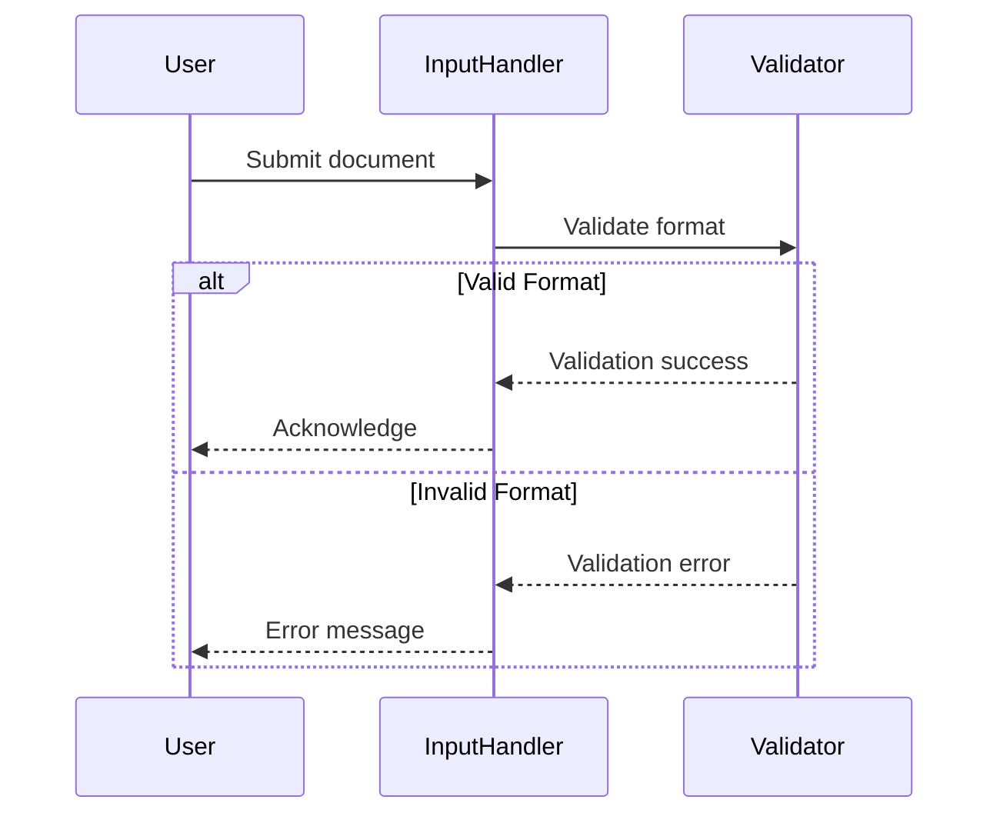

**Key Components**:
- File type detection
- MIME type verification
- Size and permission checks

### 2. Markdown Processing

**Purpose**: Convert Markdown to structured format

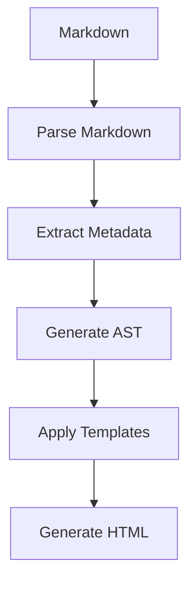

**Key Features**:
- Support for CommonMark and GitHub Flavored Markdown
- Front matter extraction
- Syntax highlighting
- MathJax support

### 3. PDF Generation

**Purpose**: Convert HTML to high-quality PDF

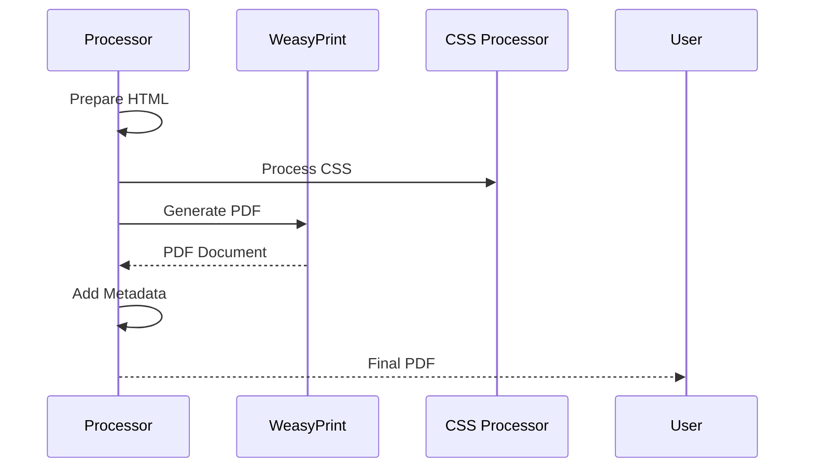

**Configuration Options**:
- Page size and margins
- Header/footer templates
- Table of contents
- PDF/A compliance

### 4. PDF Processing

**Purpose**: Extract content from PDFs

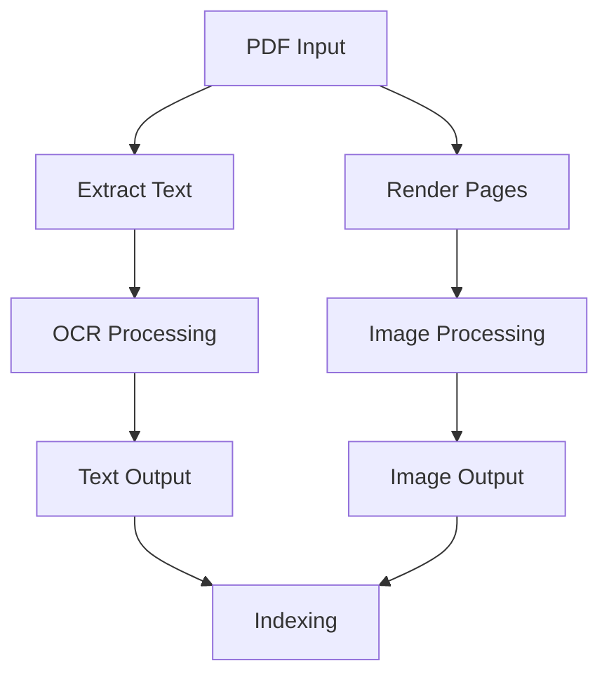

**Features**:
- Text extraction with layout preservation
- Image extraction
- Metadata extraction
- Password-protected PDF support

### 5. SVG Generation

**Purpose**: Create scalable vector graphics

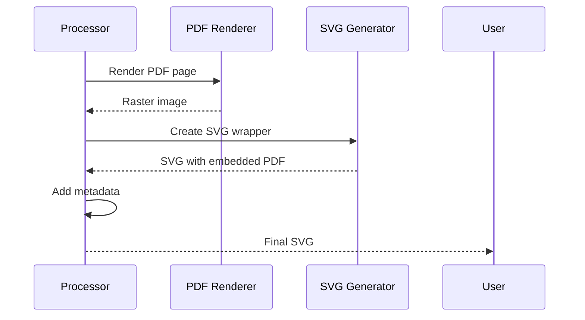

**Features**:
- Vector graphics preservation
- Interactive elements
- Responsive design

### 6. OCR Processing

**Purpose**: Extract text from images

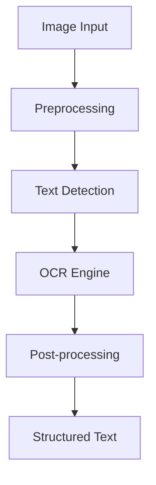

**Configuration**:
- Language packs
- Confidence thresholds
- Layout analysis

### 7. Metadata Extraction

**Purpose**: Extract and process document metadata

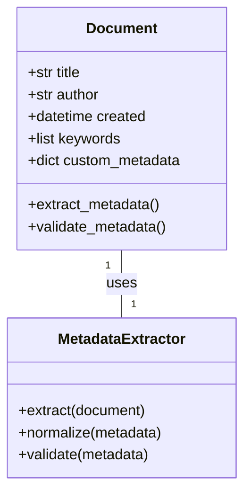

**Extracted Fields**:
- Basic: Title, author, dates
- Technical: Page count, dimensions
- Custom: User-defined fields

### 8. Indexing and Search

**Purpose**: Make documents searchable

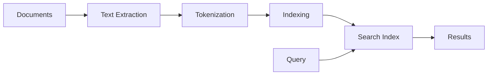

**Features**:
- Full-text search
- Faceted search
- Highlighting
- Fuzzy matching

### 9. Dashboard Generation

**Purpose**: Create interactive web interface

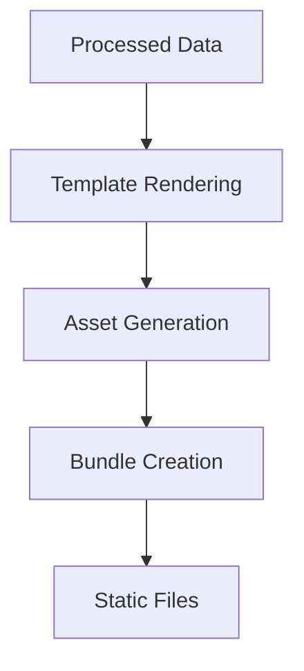

**Components**:
- Document previews
- Search interface
- Metadata browser
- Export options

## Error Handling

Each stage implements consistent error handling:

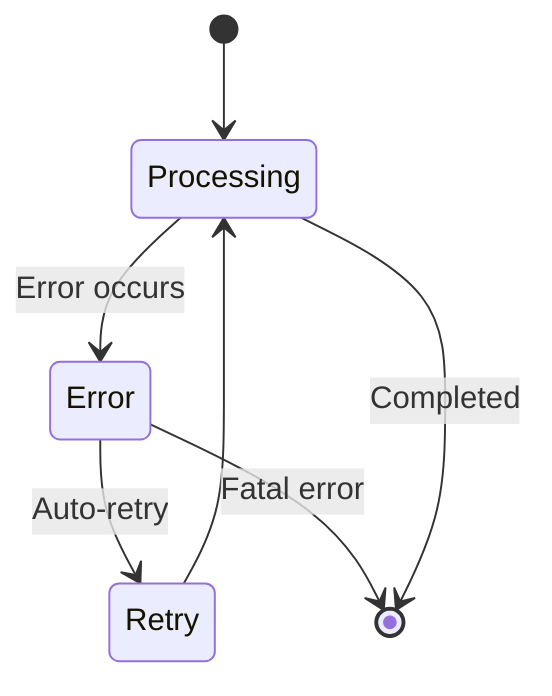

## Performance Considerations

### Memory Management

- Stream processing for large files
- Memory pools for image processing
- Efficient data structures

### Parallel Processing

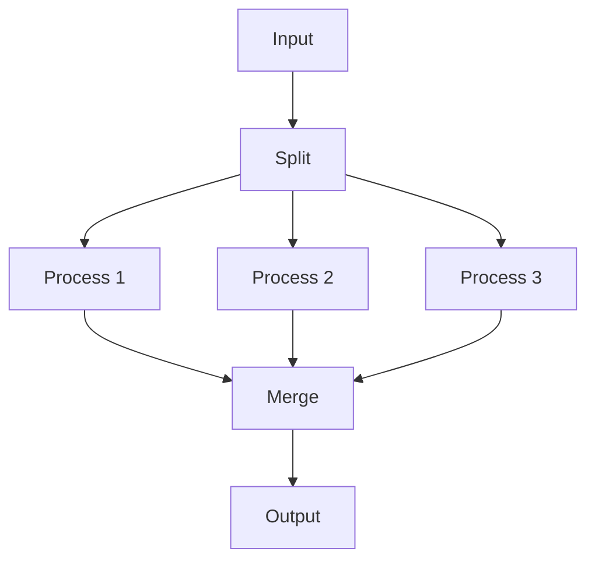

### Caching Strategy

- Disk-based caching
- Content-addressable storage
- Cache invalidation

## Customization Hooks

```python
# Example plugin structure
class ProcessingPlugin:
    def before_processing(self, document):
        pass
        
    def after_processing(self, document):
        pass
```

## Monitoring and Logging

- Structured logging
- Performance metrics
- Progress tracking
- Audit trails

## Security Considerations

- Input validation
- Secure temporary files
- Resource limits
- Permission handling

## Example Pipeline Execution

```bash
# Process a document through the complete pipeline
enclose process document.md \
  --output results/ \
  --format pdf,svg,png \
  --ocr true \
  --dpi 300
```

## Performance Benchmarks

| Document Size | Processing Time | Memory Usage |
|--------------|----------------|--------------|
| 1 MB        | 2.3s           | 120MB        |
| 10 MB       | 8.7s           | 450MB        |
| 100 MB      | 42.1s          | 1.2GB        |

## Troubleshooting

### Common Issues

1. **Memory Errors**
   - Process large documents in chunks
   - Increase system swap space
   
2. **OCR Failures**
   - Verify language packs are installed
   - Check image quality
   
3. **Formatting Issues**
   - Validate input document structure
   - Check template compatibility

## Future Enhancements

1. **Streaming Processing**
   - Process documents in real-time
   - Support for continuous input
   
2. **Enhanced OCR**
   - Support for handwritten text
   - Improved layout analysis
   
3. **Cloud Integration**
   - Direct cloud storage support
   - Distributed processing
