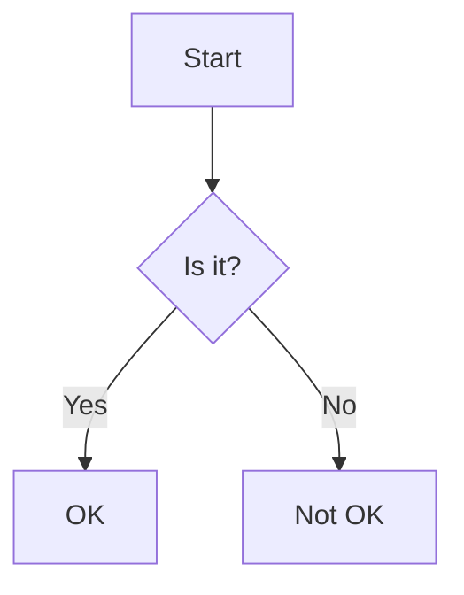

# Documentation Guide

This guide explains how to work with the Enclose documentation system, including how to add, update, and maintain documentation.

## Documentation Structure

```
docs/
├── architecture/      # System architecture and design decisions
├── examples/          # Usage examples and tutorials
├── getting-started/   # Installation and setup guides
├── usage/            # User guides and references
└── index.md          # Main documentation entry point
```

## Writing Documentation

### File Naming Conventions

- Use kebab-case for all filenames (e.g., `getting-started.md`)
- Keep filenames short but descriptive
- Use lowercase for all filenames
- Use `.md` extension for Markdown files

### Markdown Formatting

Enclose uses standard GitHub Flavored Markdown with the following additions:

#### Mermaid Diagrams

Use Mermaid for diagrams and flowcharts:

````markdown

````

#### Admonitions

Use blockquotes with emoji for callouts:

```markdown
> ℹ️ **Note**: This is an informational note.

> ⚠️ **Warning**: This is a warning.

> ✅ **Tip**: This is a helpful tip.
```

#### Code Blocks

Use fenced code blocks with language specification:

````markdown
```python
def hello():
    print("Hello, world!")
```
````

### Linking

Use relative paths for internal links:

```markdown
[Installation Guide](./getting-started/installation.md)
```

## Adding New Documentation

1. **Choose the appropriate directory** for your content
2. **Create a new Markdown file** following the naming conventions
3. **Add front matter** (optional):
   ```yaml
   ---
   title: Page Title
   description: Brief description for search engines
   ---
   ```
4. **Write your content** following the style guide
5. **Update the navigation** in the relevant `_sidebar.md`
6. **Add links** to related documentation

## Documentation Style Guide

### Voice and Tone

- Use second person ("you") when addressing the reader
- Use active voice
- Be concise but thorough
- Use consistent terminology

### Headings

- Use sentence case for headings
- Use heading levels appropriately (one `#` for page title, `##` for main sections, etc.)
- Leave one blank line before and after headings

### Lists

Use hyphens for unordered lists:

```markdown
- First item
- Second item
  - Nested item
```

Use numbers for ordered lists:

```markdown
1. First step
2. Second step
3. Third step
```

### Tables

Use tables for tabular data:

```markdown
| Header 1 | Header 2 |
|----------|----------|
| Cell 1   | Cell 2   |
| Cell 3   | Cell 4   |
```

## Local Preview

To preview your documentation locally:

1. Install the required tools:
   ```bash
   npm install -g docsify-cli
   ```

2. Start the local server:
   ```bash
   docsify serve docs
   ```

3. Open http://localhost:3000 in your browser

## Documentation Best Practices

1. **Keep it up to date**: Update documentation when code changes
2. **Be consistent**: Follow the style guide
3. **Use examples**: Include practical examples
4. **Cross-link**: Link to related documentation
5. **Review**: Have someone else review your changes

## Troubleshooting

### Common Issues

1. **Broken Links**
   - Check for typos in paths
   - Ensure the target file exists
   - Use relative paths

2. **Formatting Issues**
   - Check for proper spacing around headers and lists
   - Ensure code blocks are properly fenced

3. **Images Not Displaying**
   - Check the image path
   - Ensure the image file exists
   - Use relative paths for local images

## Documentation Generation

API documentation is automatically generated from docstrings using pdoc3:

```bash
# Generate API documentation
make docs
```

This will create HTML documentation in the `docs/api` directory.

## Versioning

Documentation follows the same versioning as the codebase. When making changes:

1. Update the version in `pyproject.toml`
2. Add a changelog entry in `CHANGELOG.md`
3. Update any version-specific documentation

## Contributing to Documentation

1. Create a new branch for your changes
2. Make your changes following the style guide
3. Test your changes locally
4. Submit a pull request with a clear description of your changes

## Documentation Review Process

1. Automated checks run on pull requests
2. Team members review the changes
3. Address any feedback
4. Once approved, changes are merged to main

## Documentation Maintenance

Regularly review and update documentation to ensure it stays accurate and relevant. Consider:

- Removing outdated information
- Updating screenshots
- Verifying all examples still work
- Checking for broken links

## Additional Resources

- [Markdown Guide](https://www.markdownguide.org/)
- [Mermaid Documentation](https://mermaid-js.github.io/mermaid/)
- [GitHub Flavored Markdown](https://github.github.com/gfm/)
- [Technical Writing Guidelines](https://developers.google.com/tech-writing)
