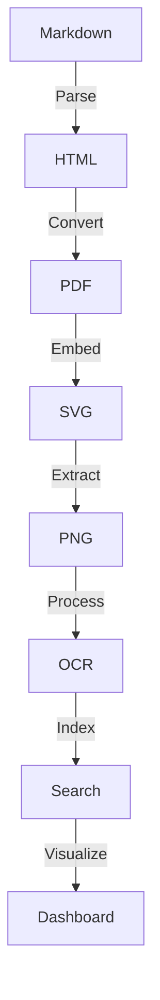

# Enclose Documentation

Welcome to the Enclose documentation! Enclose is a powerful document processing pipeline that converts Markdown files through a complete processing chain: Markdown → PDF → SVG → PNG → OCR → Search → Dashboard.

## 📚 Documentation Sections

### Getting Started
- [Installation](getting-started/installation.md)
- [Quick Start](getting-started/quick-start.md)
- [Configuration](getting-started/configuration.md)

### User Guide
- [Command Line Interface](usage/cli.md)
- [File Formats](usage/formats.md)
- [Examples](examples/)

### Architecture
- [System Overview](architecture/overview.md)
- [Processing Pipeline](architecture/pipeline.md)
- [Components](architecture/components.md)

### Development
- [Setup Guide](development/setup.md)
- [Testing](development/testing.md)
- [Contributing](development/contributing.md)

## 📊 System Architecture



## 🚀 Quick Start

1. Install the package:
   ```bash
   make install
   ```

2. Process your first document:
   ```bash
   enclose process input.md -o output/
   ```

3. View the results:
   ```bash
   open output/dashboard.html  # macOS
   xdg-open output/dashboard.html  # Linux
   ```

## 📝 License

This project is licensed under the MIT License - see the [LICENSE](LICENSE) file for details.
